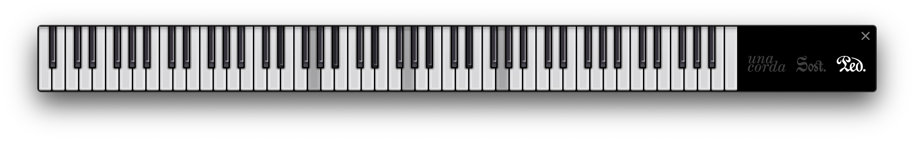

# piano-midi-monitor

Simple monitor for displaying MIDI status for digital pianos.

Supports a keyboard span of **9 octaves** (C0-B8, MIDI note number 12-119), as well as
granular pedal status display for **soft pedal/una corda** (MIDI CC number 67),
**sostenuto** (MIDI CC number 66), and **sustain** (MIDI CC number 64, values from 0-127).



Tested with Node v.14.1.0.

## Instructions

### Building

Just run:

```shell script
yarn build
```

A directory `dist/` should be generated along with build output.

### Development

Just run:

```
yarn start
```

Electron should spawn the application window.

## License

[MIT License](./LICENSE)
